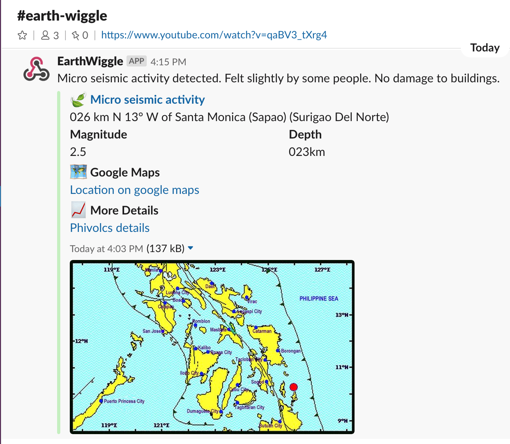

# earth-wiggle
Scrape earthquake and tsunami data from the [Philippine Institute of Volcanology and Seismology website](https://www.phivolcs.dost.gov.ph/).
Data is cached to a local SQLite database and is exposed as a simple public API. New events trigger a notification to [Slack](https://slack.com/).

## Slack Webhook Example

